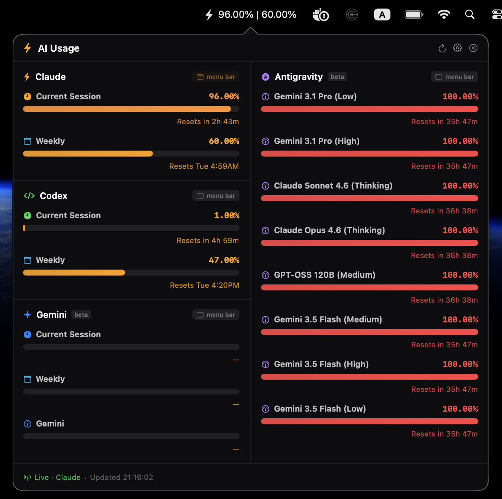
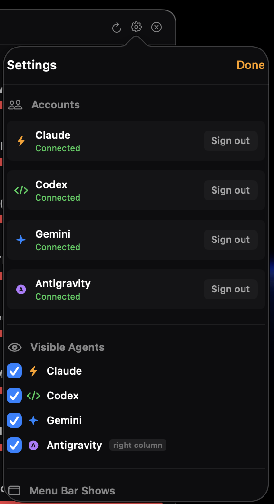

# AI Usage Counter

A macOS menu bar app for tracking AI usage limits across Claude, Codex, Gemini, and Antigravity in one place.

The app shows current session usage, weekly usage, reset times, and provider-specific quota groups without needing to keep each provider settings page open.



## Features

- **One menu bar monitor** for Claude, Codex, Gemini, and Antigravity.
- **Session and weekly usage** for Claude, Codex, and Gemini, including reset countdowns.
- **Antigravity model quota tracking** for Gemini, Claude, and GPT quota groups.
- **Selectable visible agents** so the popup only shows the providers you care about.
- **Selectable menu bar source** from any connected provider.
- **Two-column popup layout** when Antigravity is enabled alongside other agents.
- **Automatic refresh and backoff** to keep usage current without constantly polling.
- **Claude local estimate mode** when claude.ai is not connected, based on local Claude Code usage files.



## Supported Providers

| Provider | What It Shows | Notes |
| --- | --- | --- |
| Claude | Current session, weekly usage, reset times | Uses claude.ai usage data when connected. Falls back to a local estimate if not signed in. |
| Codex | Current session, weekly usage, reset times | Uses the signed-in ChatGPT/Codex usage page data. |
| Gemini | Current session and weekly usage | Beta support. Reads the Gemini usage limits page because Google does not provide a public API for this data. |
| Antigravity | Per-model quota groups and reset times | Reads quotas from the local Antigravity language server after sign-in. |

## Installation

1. Download the latest DMG from [GitHub Releases](https://github.com/lazymodthai/ai-usage-counter/releases).
2. Open the DMG.
3. Drag **Claude Usage Counter** into **Applications**.
4. Launch the app from **Applications** or Launchpad.
5. Look for the AI Usage Counter icon in the macOS menu bar.

If macOS warns that the app cannot be opened because it is from an unidentified developer, right-click the app and choose **Open** once.

To launch automatically when you sign in:

1. Open **System Settings**.
2. Go to **General** -> **Login Items**.
3. Click **+**.
4. Select **Claude Usage Counter** from Applications.

## Usage

1. Click the menu bar icon.
2. Open **Settings**.
3. In **Accounts**, sign in to the providers you want to track.
4. Use **Visible Agents** to choose which providers appear in the popup.
5. Use **Menu Bar Shows** to choose what the menu bar displays.

You can also click a provider's **menu bar** badge in the popup to make that provider the active menu bar display.

When a provider session expires, the app shows a session-expired state. Open Settings and sign in again for that provider.

## Menu Bar Display

The menu bar shows compact usage status for the selected provider:

```text
96.00% | 60.00%     session usage | weekly usage
46m | 60.00%        session limit reached, reset countdown shown
30s | Tue 5:00AM    near reset, weekly reset time shown
```

For Antigravity, the menu bar summarizes quota groups as:

```text
Gemini group | Claude + GPT group
```

If a quota group is full, the app shows the reset countdown instead of the percentage.

## Privacy

- Provider cookies are stored inside the app's own WebKit data stores.
- The app does not share cookies with Safari or Chrome.
- Usage requests go directly from your Mac to the relevant provider.
- Claude local estimate mode reads local Claude Code usage files only on your Mac.
- No usage data is uploaded to a third-party analytics service by this app.

## Limitations

- Some providers do not publish public usage APIs, so parts of the app depend on internal web endpoints or provider pages.
- Provider-side changes can temporarily break usage detection until the app is updated.
- Gemini support is beta and may depend on whether Google allows sign-in inside the app's WebView.
- Antigravity tracking requires the local Antigravity app or language server to be available.

## System Requirements

- macOS 14 Sonoma or later

## Build From Source

This repository is a Swift Package project.

```bash
swift build -c release
```

To create a local DMG:

```bash
./build.sh
./release.sh
```

## License

MIT
